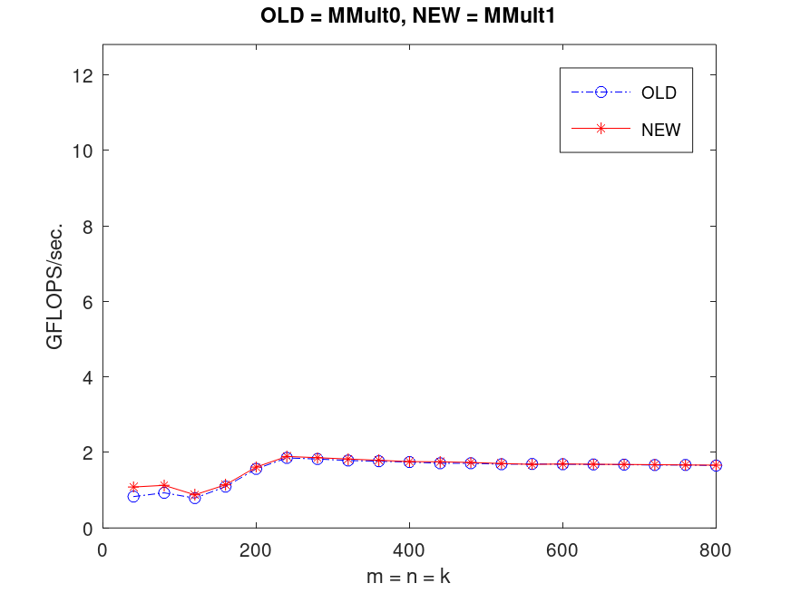
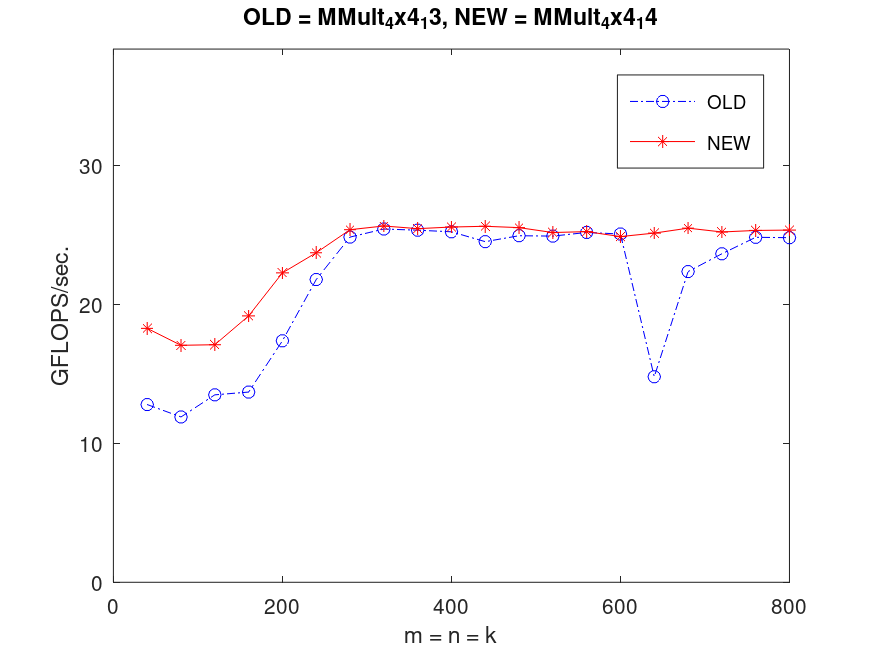

# Antoni Wójcik, 12.04.2024r.
## Optymalizacja Kodu Na Różne Architektury, gr. 5
## Zadanie domowe nr 1

### I Parametry procesora
| Parametr | Wartość |
|:---:|:---:|
| Producent | Apple |
| Model | Apple M1 |
| Architektura | ARM |
| Mikroarchitektura| "Firestorm" (rdzenie wydajnościowe) | 
| | "Icestorm" (rdzenie energooszczędne) |
| Rdzenie | 8 (4 wydajnościowe + 4 energooszczędne) |
| Wątki | 8 |
| Max. częstotliwość | 3.2 GHz (rdzenie wydajnościowe) |
| | 2.06 (rdzenie energooszczędne) |
| L1 cache | 192+128 KB /rdzeń (rdzenie wydajnościowe) |
| | 128+64 KB /rdzeń (rdzenie energooszczędne) | 
| L2 cache | 12 MB (rdzenie wydajnościowe) |
| | 4 MB (rdzenie energooszczędne) |
| L3 cahce (last level cahce) | 8 MB |
| GFlops | 2 290 (FP32 Single Precision) |
| GFlops/rdzeń | 286.25 |

[Źródło: Wikipedia (niestety bardzo ciężko o porządną dokumentacje od Apple)](https://en.wikipedia.org/wiki/Apple_M1#cite_note-anandtech-1) <br>
[Źródło: Cpu-monkey](https://www.cpu-monkey.com/en/cpu-apple_m1) <br>

### II Zmiany wynikające z architektury procesora
Aby tutorial działał poprawnie, dokonałem następujących zmian w `makefile`: <br>
Zmieniłem
```MakeFile
...
CC         := gcc
LINKER     := $(CC)
CFLAGS     := -O2 -Wall -msse3
LDFLAGS    := -lm
...
```
Na:
```MakeFile
...
CC         := clang
LINKER     := $(CC)
CFLAGS     := -O2 -Wall -target arm64-apple-macos
LDFLAGS    := -lm
...
```

### III Optymalizacje

#### Test konfiguracji:
Wykonując `make run` oraz `PlotAll` otrzymałem wykres prezentujący brak jakichkolwiek optymalizacji. 

#### Optymalizacja 1
Dokonano optymalizacji poprzez zastosowanie funkcji `AddDot`, która jest wywoływana dla każdego elementu macierzy wynikowej C oraz dodano makra. 
Wynik: 

#### Optymalizacja 2
W kolejnej wersji kodu wprowadzono kolejną optymalizację poprzez unrolling pętli wewnętrznej, czyli "rozwinięcie" jej przez 4 iteracje.
Wynik: 

Powysze optymalizacje nie wpłynęły znacząco na wydajność, są jedynie podstawą dalszych optymalizacji.

#### Optymalizacja (1x4) 3
W kolejnej iteracji optymalizacji kodu wprowadzono kolejną zmianę, dzieląc operacje mnożenia macierzy na mniejsze bloki wewnątrz funkcji `MY_MMult`.
Zmiany w kodzie obejmują dodanie nowej funkcji AddDot1x4, która oblicza cztery kolejne elementy macierzy wynikowej C jednocześnie.
Wynik: 

#### Optymalizacja (1x4) 4
Zamiast wywoływać funkcję `AddDot`, każda z czterech iteracji w funkcji `AddDot1x4` wykonuje bezpośrednio operacje mnożenia macierzy i dodawania, co pozwala uniknąć kosztu wywoływania funkcji.
Nastąpił dodatkowo unrolling pętli wewnętrznej.
Wynik: 

#### Optymalizacja (1x4) 5
Scalenie czterech pętli `for` w funkcji `AddDot1x4` w jedną pętlę, która oblicza cztery kolejne elementy macierzy wynikowej `C` równocześnie.
Wynik: 

#### Optymalizacja (1x4) 6
W tej zmianie wprowadzono wykorzystanie rejestrów procesora do akumulacji wartości w funkcji `AddDot1x4`. Zamiast bezpośredniego zapisywania wyników do pamięci podręcznej, wartości są akumulowane w rejestrach procesora, co może znacznie zwiększyć wydajność poprzez zmniejszenie dostępu do pamięci. Zaobserwowano znaczący wzrost wydajności.
Wynik: 

#### Optymalizacja (1x4) 7
Wykorzystanie wskaźników do śledzenia położenia w czterech kolumnach macierzy `B`. Zamiast adresów kolumn macierzy `B` przekazywanych bezpośrednio do funkcji, teraz wskaźniki `bp0_pntr`, `bp1_pntr`, `bp2_pntr`, `bp3_pntr` śledzą aktualne pozycje w tych kolumnach, co pozwala na bezpośrednie przesunięcie wskaźników wewnątrz pętli, zamiast wyliczania adresów w każdej iteracji.
Wynik: 

#### Optymalizacja (1x4) 8
Rozwinięcie pętli o czynnik 4 (`p` zwiększane jest o 4 w każdej iteracji). Dzięki temu można teraz wykonać cztery iteracje pętli w jednej iteracji zwykłej pętli `for`.
Wynik: 

#### Optymalizacja (1x4) 9
Dodano zastosowanie adresowania pośredniego (indirect addressing) dla dostępu do elementów macierzy `B`. Zamiast używać wskaźników do bezpośredniego dostępu do kolejnych elementów macierzy `B`, teraz wskaźniki te są zwiększane o 4 w każdej iteracji pętli, co pozwala na odczytanie czterech kolejnych elementów macierzy w jednej iteracji pętli zamiast jednego elementu w jednej iteracji.
Wynik: 

#### Optymalizacja (4x4) 3
Dzięki unrollingu pętli i obliczaniu 4x4 bloków macierzy C naraz, zwiększa się lokalność danych. Oznacza to, że dane potrzebne do obliczeń są bardziej prawdopodobne do przechowywania w cache'u procesora, co może znacznie przyspieszyć wykonywanie operacji.
Wynik: 

#### Optymalizacja (4x4) 4
Zmieniono kod poprzez zastąpienie wywołań funkcji AddDot przez bezpośrednie obliczenia w funkcji AddDot4x4 oraz usunięcie pętli wewnętrznej. Dodatkowo, dostęp do elementów macierzy został zoptymalizowany poprzez bezpośrednie odwołanie się do nich.
Wynik: 

#### Optymalizacja (4x4) 5
Scalenie czterech pętli w jedną, co umożliwia obliczanie czterech iloczynów skalarnych jednocześnie.
Wynik: 

#### Optymalizacja (4x4) 6
Zastosowano rejestrowanie, aby zmaksymalizować wykorzystanie rejestrów procesora. Odpowiednio, zmienne rejestrowe przechowują częściowe sumy zamiast bezpośrednio aktualizować wartości w macierzy `C` w każdej iteracji pętli. Na końcu pętli wartości zmiennych rejestrowych są dodawane do odpowiednich elementów macierzy `C`.
<B>Ta zmiana spowodowała kolosalny wzrost wydajności, konieczne bylo a przeskalowanie wykresu.</B>
Wynik: 

#### Optymalizacja (4x4) 7
Wykorzystanie wskaźników do śledzenia aktualnej pozycji w czterech kolumnach macierzy B.
Wynik: 

#### Optymalizacja (4x4) 8
Wykorzystanie rejestrów do przechowywania elementów wiersza macierzy `B`. Ponadto użyto wskaźników do śledzenia aktualnej pozycji w czterech kolumnach macierzy.
Wynik: 

#### Optymalizacja (4x4) 9
W tej wersji kodu zmieniono kolejność obliczeń, aby zwiększyć wykorzystanie rejestrów i potencjalnie przyspieszyć działanie programu.
Najpierw obliczane są wartości dla pierwszych dwóch wierszy macierzy `C`, a następnie dla kolejnych dwóch.
Wynik: 

#### Optymalizacja (4x4) 10
Wykorzystanie instrukcji wektorowych i rejestrów wektorowych (`__m128d`) do przyspieszenia obliczeń.
Zamiast przetwarzać pojedyncze liczby zmiennoprzecinkowe, obliczenia są wykonywane na parach wartości (`double`) w jednym rejestrze wektorowym.
<B> Uwaga! </B><br>
Z uwagi na architekturę mojego procesora musiałem dokonać następujących zmian: <br>

``` C
#include <arm_neon.h>  // Include NEON intrinsics header for ARM architecture

typedef float32x2_t v2df_t;  // Define a vector type for NEON operations

void AddDot4x4(int k, double *a, int lda, double *b, int ldb, double *c, int ldc) {
    int p;

    v2df_t
        c_00_c_10_vreg, c_01_c_11_vreg, c_02_c_12_vreg, c_03_c_13_vreg,
        c_20_c_30_vreg, c_21_c_31_vreg, c_22_c_32_vreg, c_23_c_33_vreg,
        a_0p_a_1p_vreg, a_2p_a_3p_vreg,
        b_p0_vreg, b_p1_vreg, b_p2_vreg, b_p3_vreg;

    double *b_p0_pntr, *b_p1_pntr, *b_p2_pntr, *b_p3_pntr;
    b_p0_pntr = &B(0, 0);
    b_p1_pntr = &B(0, 1);
    b_p2_pntr = &B(0, 2);
    b_p3_pntr = &B(0, 3);

    c_00_c_10_vreg = vdup_n_f32(0.0f);
    c_01_c_11_vreg = vdup_n_f32(0.0f);
    c_02_c_12_vreg = vdup_n_f32(0.0f);
    c_03_c_13_vreg = vdup_n_f32(0.0f);
    c_20_c_30_vreg = vdup_n_f32(0.0f);
    c_21_c_31_vreg = vdup_n_f32(0.0f);
    c_22_c_32_vreg = vdup_n_f32(0.0f);
    c_23_c_33_vreg = vdup_n_f32(0.0f);

    for (p = 0; p < k; p++) {
        a_0p_a_1p_vreg = vld1_f32((float32_t *)&A(0, p));
        a_2p_a_3p_vreg = vld1_f32((float32_t *)&A(2, p));

        b_p0_vreg = vdup_n_f32((float32_t)*b_p0_pntr++);
        b_p1_vreg = vdup_n_f32((float32_t)*b_p1_pntr++);
        b_p2_vreg = vdup_n_f32((float32_t)*b_p2_pntr++);
        b_p3_vreg = vdup_n_f32((float32_t)*b_p3_pntr++);

        c_00_c_10_vreg = vfma_lane_f32(c_00_c_10_vreg, a_0p_a_1p_vreg, b_p0_vreg, 0);
        c_01_c_11_vreg = vfma_lane_f32(c_01_c_11_vreg, a_0p_a_1p_vreg, b_p1_vreg, 0);
        c_02_c_12_vreg = vfma_lane_f32(c_02_c_12_vreg, a_0p_a_1p_vreg, b_p2_vreg, 0);
        c_03_c_13_vreg = vfma_lane_f32(c_03_c_13_vreg, a_0p_a_1p_vreg, b_p3_vreg, 0);

        c_20_c_30_vreg = vfma_lane_f32(c_20_c_30_vreg, a_2p_a_3p_vreg, b_p0_vreg, 0);
        c_21_c_31_vreg = vfma_lane_f32(c_21_c_31_vreg, a_2p_a_3p_vreg, b_p1_vreg, 0);
        c_22_c_32_vreg = vfma_lane_f32(c_22_c_32_vreg, a_2p_a_3p_vreg, b_p2_vreg, 0);
        c_23_c_33_vreg = vfma_lane_f32(c_23_c_33_vreg, a_2p_a_3p_vreg, b_p3_vreg, 0);
    }

    C(0, 0) += c_00_c_10_vreg[0];
    C(0, 1) += c_01_c_11_vreg[0];
    C(0, 2) += c_02_c_12_vreg[0];
    C(0, 3) += c_03_c_13_vreg[0];

    C(1, 0) += c_00_c_10_vreg[1];
    C(1, 1) += c_01_c_11_vreg[1];
    C(1, 2) += c_02_c_12_vreg[1];
    C(1, 3) += c_03_c_13_vreg[1];

    C(2, 0) += c_20_c_30_vreg[0];
    C(2, 1) += c_21_c_31_vreg[0];
    C(2, 2) += c_22_c_32_vreg[0];
    C(2, 3) += c_23_c_33_vreg[0];

    C(3, 0) += c_20_c_30_vreg[1];
    C(3, 1) += c_21_c_31_vreg[1];
    C(3, 2) += c_22_c_32_vreg[1];
    C(3, 3) += c_23_c_33_vreg[1];
}
```

W swojej wersji:
- zrezygnowałem z bibliotek `mmintrin.h` oraz `xmmintrin.h`, `pmmintrin.h` oraz `emmintrin.h`, które nie są dostępne na moim procesorze.
- zamiast tego użyłem bibliotekę `arm_neon.h`, która zawiera instrukcje wektorowe dla architektury ARM.
- zmieniłem typ wektora na `float32x2_t`, który reprezentuje wektor dwóch wartości zmiennoprzecinkowych pojedynczej precyzji.
- zmieniłem funkcje na odpowiednie dla architektury ARM, np. `vdup_n_f32()`, `vld1_f32()`, `vfma_lane_f32()`.

Wynik: 

#### Optymalizacja (4x4) 11
W tej wersji kodu dodano parametry `mc` i `kc`, które określają rozmiar bloków. Algorytm jest teraz zorganizowany w taki sposób, że obliczenia są wykonywane na blokach o rozmiarze `mc` x `kc` macierzy `C`, co może zwiększyć wydajność poprzez lepsze wykorzystanie pamięci podręcznej procesora i umożliwienie optymalizacji pętli. Dodano również funkcję `InnerKernel`, która jest odpowiedzialna za obliczenia na bloku `mc` x `kc`, co pozwala na lepszą modularność kodu i czytelność.<br>
Kod (musiałem dokonać znów zmiany w kodzie, aby działał na moim procesorze):
``` C
#include <arm_neon.h>

void AddDot4x4( int k, double *a, int lda,  double *b, int ldb, double *c, int ldc )
{
  /* So, this routine computes a 4x4 block of matrix A

           C( 0, 0 ), C( 0, 1 ), C( 0, 2 ), C( 0, 3 ).  
           C( 1, 0 ), C( 1, 1 ), C( 1, 2 ), C( 1, 3 ).  
           C( 2, 0 ), C( 2, 1 ), C( 2, 2 ), C( 2, 3 ).  
           C( 3, 0 ), C( 3, 1 ), C( 3, 2 ), C( 3, 3 ).  

     Notice that this routine is called with c = C( i, j ) in the
     previous routine, so these are actually the elements 

           C( i  , j ), C( i  , j+1 ), C( i  , j+2 ), C( i  , j+3 ) 
           C( i+1, j ), C( i+1, j+1 ), C( i+1, j+2 ), C( i+1, j+3 ) 
           C( i+2, j ), C( i+2, j+1 ), C( i+2, j+2 ), C( i+2, j+3 ) 
           C( i+3, j ), C( i+3, j+1 ), C( i+3, j+2 ), C( i+3, j+3 ) 
	  
     in the original matrix C 

     And now we use vector registers and instructions */

  int p;
  float64x2_t
    c_00_c_10_vreg,    c_01_c_11_vreg,    c_02_c_12_vreg,    c_03_c_13_vreg,
    c_20_c_30_vreg,    c_21_c_31_vreg,    c_22_c_32_vreg,    c_23_c_33_vreg,
    a_0p_a_1p_vreg,
    a_2p_a_3p_vreg,
    b_p0_vreg, b_p1_vreg, b_p2_vreg, b_p3_vreg; 

  double 
    /* Point to the current elements in the four columns of B */
    *b_p0_pntr, *b_p1_pntr, *b_p2_pntr, *b_p3_pntr; 
    
  b_p0_pntr = &B( 0, 0 );
  b_p1_pntr = &B( 0, 1 );
  b_p2_pntr = &B( 0, 2 );
  b_p3_pntr = &B( 0, 3 );

  c_00_c_10_vreg = vdupq_n_f64(0.0);   
  c_01_c_11_vreg = vdupq_n_f64(0.0);
  c_02_c_12_vreg = vdupq_n_f64(0.0); 
  c_03_c_13_vreg = vdupq_n_f64(0.0); 
  c_20_c_30_vreg = vdupq_n_f64(0.0);   
  c_21_c_31_vreg = vdupq_n_f64(0.0);  
  c_22_c_32_vreg = vdupq_n_f64(0.0);   
  c_23_c_33_vreg = vdupq_n_f64(0.0); 

  for ( p=0; p<k; p++ ){
    a_0p_a_1p_vreg = vld1q_f64( &A( 0, p ) );
    a_2p_a_3p_vreg = vld1q_f64( &A( 2, p ) );

    b_p0_vreg = vld1q_dup_f64( b_p0_pntr++ );   /* load and duplicate */
    b_p1_vreg = vld1q_dup_f64( b_p1_pntr++ );   /* load and duplicate */
    b_p2_vreg = vld1q_dup_f64( b_p2_pntr++ );   /* load and duplicate */
    b_p3_vreg = vld1q_dup_f64( b_p3_pntr++ );   /* load and duplicate */

    /* First row and second rows */
    c_00_c_10_vreg = vmlaq_f64(c_00_c_10_vreg, a_0p_a_1p_vreg, b_p0_vreg);
    c_01_c_11_vreg = vmlaq_f64(c_01_c_11_vreg, a_0p_a_1p_vreg, b_p1_vreg);
    c_02_c_12_vreg = vmlaq_f64(c_02_c_12_vreg, a_0p_a_1p_vreg, b_p2_vreg);
    c_03_c_13_vreg = vmlaq_f64(c_03_c_13_vreg, a_0p_a_1p_vreg, b_p3_vreg);

    /* Third and fourth rows */
    c_20_c_30_vreg = vmlaq_f64(c_20_c_30_vreg, a_2p_a_3p_vreg, b_p0_vreg);
    c_21_c_31_vreg = vmlaq_f64(c_21_c_31_vreg, a_2p_a_3p_vreg, b_p1_vreg);
    c_22_c_32_vreg = vmlaq_f64(c_22_c_32_vreg, a_2p_a_3p_vreg, b_p2_vreg);
    c_23_c_33_vreg = vmlaq_f64(c_23_c_33_vreg, a_2p_a_3p_vreg, b_p3_vreg);
  }

  C( 0, 0 ) += c_00_c_10_vreg[0];  C( 0, 1 ) += c_01_c_11_vreg[0];  
  C( 0, 2 ) += c_02_c_12_vreg[0];  C( 0, 3 ) += c_03_c_13_vreg[0]; 

  C( 1, 0 ) += c_00_c_10_vreg[1];  C( 1, 1 ) += c_01_c_11_vreg[1];  
  C( 1, 2 ) += c_02_c_12_vreg[1];  C( 1, 3 ) += c_03_c_13_vreg[1]; 

  C( 2, 0 ) += c_20_c_30_vreg[0];  C( 2, 1 ) += c_21_c_31_vreg[0];  
  C( 2, 2 ) += c_22_c_32_vreg[0];  C( 2, 3 ) += c_23_c_33_vreg[0]; 

  C( 3, 0 ) += c_20_c_30_vreg[1];  C( 3, 1 ) += c_21_c_31_vreg[1];  
  C( 3, 2 ) += c_22_c_32_vreg[1];  C( 3, 3 ) += c_23_c_33_vreg[1]; 
}
```
Wynik: 

#### Optymalizacja (4x4) 12
W tej wersji kodu dodano funkcję `PackMatrixA`, która jest odpowiedzialna za pakowanie kolumn macierzy `A` do bufora `packedA`. Następnie ten bufor jest wykorzystywany w funkcji `InnerKernel`, aby obliczyć wartości macierzy `C`. Dodano również parametry `pb` i `ib` do pętli w funkcji `MY_MMult`, które określają rozmiar bloków obliczeń, co pozwala na lepszą kontrolę nad operacjami na macierzach.<br>
Kod (musiałem dokonać znów zmiany w kodzie, aby działał na moim procesorze):
``` C
#include <arm_neon.h>

typedef float64x2_t v2df_t;

void AddDot4x4( int k, double *a, int lda,  double *b, int ldb, double *c, int ldc )
{
  int p;
  v2df_t
    c_00_c_10_vreg,    c_01_c_11_vreg,    c_02_c_12_vreg,    c_03_c_13_vreg,
    c_20_c_30_vreg,    c_21_c_31_vreg,    c_22_c_32_vreg,    c_23_c_33_vreg,
    a_0p_a_1p_vreg,
    a_2p_a_3p_vreg,
    b_p0_vreg, b_p1_vreg, b_p2_vreg, b_p3_vreg;

  double 
    *b_p0_pntr, *b_p1_pntr, *b_p2_pntr, *b_p3_pntr;

  b_p0_pntr = &B( 0, 0 );
  b_p1_pntr = &B( 0, 1 );
  b_p2_pntr = &B( 0, 2 );
  b_p3_pntr = &B( 0, 3 );

  c_00_c_10_vreg = vdupq_n_f64(0);
  c_01_c_11_vreg = vdupq_n_f64(0);
  c_02_c_12_vreg = vdupq_n_f64(0);
  c_03_c_13_vreg = vdupq_n_f64(0);
  c_20_c_30_vreg = vdupq_n_f64(0);
  c_21_c_31_vreg = vdupq_n_f64(0);
  c_22_c_32_vreg = vdupq_n_f64(0);
  c_23_c_33_vreg = vdupq_n_f64(0);

  for ( p = 0; p < k; p++ ){
    a_0p_a_1p_vreg = vld1q_f64(&A( 0, p ));
    a_2p_a_3p_vreg = vld1q_f64(&A( 2, p ));

    b_p0_vreg = vdupq_n_f64(*b_p0_pntr++);
    b_p1_vreg = vdupq_n_f64(*b_p1_pntr++);
    b_p2_vreg = vdupq_n_f64(*b_p2_pntr++);
    b_p3_vreg = vdupq_n_f64(*b_p3_pntr++);

    c_00_c_10_vreg = vmlaq_f64(c_00_c_10_vreg, a_0p_a_1p_vreg, b_p0_vreg);
    c_01_c_11_vreg = vmlaq_f64(c_01_c_11_vreg, a_0p_a_1p_vreg, b_p1_vreg);
    c_02_c_12_vreg = vmlaq_f64(c_02_c_12_vreg, a_0p_a_1p_vreg, b_p2_vreg);
    c_03_c_13_vreg = vmlaq_f64(c_03_c_13_vreg, a_0p_a_1p_vreg, b_p3_vreg);

    c_20_c_30_vreg = vmlaq_f64(c_20_c_30_vreg, a_2p_a_3p_vreg, b_p0_vreg);
    c_21_c_31_vreg = vmlaq_f64(c_21_c_31_vreg, a_2p_a_3p_vreg, b_p1_vreg);
    c_22_c_32_vreg = vmlaq_f64(c_22_c_32_vreg, a_2p_a_3p_vreg, b_p2_vreg);
    c_23_c_33_vreg = vmlaq_f64(c_23_c_33_vreg, a_2p_a_3p_vreg, b_p3_vreg);
  }

  C( 0, 0 ) += vgetq_lane_f64(c_00_c_10_vreg, 0);
  C( 0, 1 ) += vgetq_lane_f64(c_01_c_11_vreg, 0);
  C( 0, 2 ) += vgetq_lane_f64(c_02_c_12_vreg, 0);
  C( 0, 3 ) += vgetq_lane_f64(c_03_c_13_vreg, 0);

  C( 1, 0 ) += vgetq_lane_f64(c_00_c_10_vreg, 1);
  C( 1, 1 ) += vgetq_lane_f64(c_01_c_11_vreg, 1);
  C( 1, 2 ) += vgetq_lane_f64(c_02_c_12_vreg, 1);
  C( 1, 3 ) += vgetq_lane_f64(c_03_c_13_vreg, 1);

  C( 2, 0 ) += vgetq_lane_f64(c_20_c_30_vreg, 0);
  C( 2, 1 ) += vgetq_lane_f64(c_21_c_31_vreg, 0);
  C( 2, 2 ) += vgetq_lane_f64(c_22_c_32_vreg, 0);
  C( 2, 3 ) += vgetq_lane_f64(c_23_c_33_vreg, 0);

  C( 3, 0 ) += vgetq_lane_f64(c_20_c_30_vreg, 1);
  C( 3, 1 ) += vgetq_lane_f64(c_21_c_31_vreg, 1);
  C( 3, 2 ) += vgetq_lane_f64(c_22_c_32_vreg, 1);
  C( 3, 3 ) += vgetq_lane_f64(c_23_c_33_vreg, 1);
}
```

Wynik: 

#### Optymalizacja (4x4) 13
W tej wersji kodu zmieniono sposób ładowania danych macierzy `A` w funkcji `AddDot4x4`. Zamiast wielokrotnego dostępu do pamięci za każdym razem, gdy potrzebny jest kolejny element macierzy `A`, teraz najpierw wczytywane są dwa wektory z macierzy `A`, a następnie wykorzystywane są one wielokrotnie do obliczeń.<br>
Kod (musiałem dokonać znów zmiany w kodzie, aby działał na moim procesorze):
``` C
#include <arm_neon.h>

typedef float32x2_t v2df_t;

void AddDot4x4(int k, double *a, int lda, double *b, int ldb, double *c, int ldc) {
    int p;
    v2df_t
    c_00_c_10_vreg, c_01_c_11_vreg, c_02_c_12_vreg, c_03_c_13_vreg,
    c_20_c_30_vreg, c_21_c_31_vreg, c_22_c_32_vreg, c_23_c_33_vreg,
    a_0p_a_1p_vreg,
    a_2p_a_3p_vreg,
    b_p0_vreg, b_p1_vreg, b_p2_vreg, b_p3_vreg;

    double
    *b_p0_pntr, *b_p1_pntr, *b_p2_pntr, *b_p3_pntr;

    b_p0_pntr = &B(0, 0);
    b_p1_pntr = &B(0, 1);
    b_p2_pntr = &B(0, 2);
    b_p3_pntr = &B(0, 3);

    c_00_c_10_vreg = vdup_n_f32(0);
    c_01_c_11_vreg = vdup_n_f32(0);
    c_02_c_12_vreg = vdup_n_f32(0);
    c_03_c_13_vreg = vdup_n_f32(0);
    c_20_c_30_vreg = vdup_n_f32(0);
    c_21_c_31_vreg = vdup_n_f32(0);
    c_22_c_32_vreg = vdup_n_f32(0);
    c_23_c_33_vreg = vdup_n_f32(0);

    for (p = 0; p < k; p++) {
        a_0p_a_1p_vreg = vld1_f32((float32_t *)a);
        a_2p_a_3p_vreg = vld1_f32((float32_t *)(a + 2));
        a += 4;

        b_p0_vreg = vdup_n_f32(*b_p0_pntr++);
        b_p1_vreg = vdup_n_f32(*b_p1_pntr++);
        b_p2_vreg = vdup_n_f32(*b_p2_pntr++);
        b_p3_vreg = vdup_n_f32(*b_p3_pntr++);

        c_00_c_10_vreg = vmla_lane_f32(c_00_c_10_vreg, a_0p_a_1p_vreg, b_p0_vreg, 0);
        c_01_c_11_vreg = vmla_lane_f32(c_01_c_11_vreg, a_0p_a_1p_vreg, b_p1_vreg, 0);
        c_02_c_12_vreg = vmla_lane_f32(c_02_c_12_vreg, a_0p_a_1p_vreg, b_p2_vreg, 0);
        c_03_c_13_vreg = vmla_lane_f32(c_03_c_13_vreg, a_0p_a_1p_vreg, b_p3_vreg, 0);

        c_20_c_30_vreg = vmla_lane_f32(c_20_c_30_vreg, a_2p_a_3p_vreg, b_p0_vreg, 0);
        c_21_c_31_vreg = vmla_lane_f32(c_21_c_31_vreg, a_2p_a_3p_vreg, b_p1_vreg, 0);
        c_22_c_32_vreg = vmla_lane_f32(c_22_c_32_vreg, a_2p_a_3p_vreg, b_p2_vreg, 0);
        c_23_c_33_vreg = vmla_lane_f32(c_23_c_33_vreg, a_2p_a_3p_vreg, b_p3_vreg, 0);
    }

    C(0, 0) += vget_lane_f32(c_00_c_10_vreg, 0);
    C(0, 1) += vget_lane_f32(c_01_c_11_vreg, 0);
    C(0, 2) += vget_lane_f32(c_02_c_12_vreg, 0);
    C(0, 3) += vget_lane_f32(c_03_c_13_vreg, 0);

    C(1, 0) += vget_lane_f32(c_00_c_10_vreg, 1);
    C(1, 1) += vget_lane_f32(c_01_c_11_vreg, 1);
    C(1, 2) += vget_lane_f32(c_02_c_12_vreg, 1);
    C(1, 3) += vget_lane_f32(c_03_c_13_vreg, 1);

    C(2, 0) += vget_lane_f32(c_20_c_30_vreg, 0);
    C(2, 1) += vget_lane_f32(c_21_c_31_vreg, 0);
    C(2, 2) += vget_lane_f32(c_22_c_32_vreg, 0);
    C(2, 3) += vget_lane_f32(c_23_c_33_vreg, 0);

    C(3, 0) += vget_lane_f32(c_20_c_30_vreg, 1);
    C(3, 1) += vget_lane_f32(c_21_c_31_vreg, 1);
    C(3, 2) += vget_lane_f32(c_22_c_32_vreg, 1);
    C(3, 3) += vget_lane_f32(c_23_c_33_vreg, 1);
}
```

Wynik: 

#### Optymalizacja (4x4) 14
Zmiany wprowadzone w kodzie obejmują dodanie funkcji `PackMatrixB` oraz parametru `first_time` w funkcji `InnerKernel`.
Funkcja `PackMatrixB` jest analogiczna do `PackMatrixA`, ale zajmuje się pakowaniem macierzy `B` zamiast macierzy `A`. Ta funkcja jest wywoływana w pętli wewnętrznej `InnerKernel` do pakowania macierzy `B` przed wywołaniem funkcji `AddDot4x4`.
Parametr `first_time` w funkcji `InnerKernel` jest flagą logiczną, która określa, czy jest to pierwsze wywołanie funkcji `InnerKernel` dla danego bloku macierzy `C`. Jeśli tak, to funkcja `PackMatrixA` jest wywoływana do pakowania macierzy `A` tylko raz na blok macierzy `C`, co przyspiesza obliczenia poprzez uniknięcie wielokrotnego pakowania tych samych danych.<br>

Kod (musiałem dokonać znów zmiany w kodzie, aby działał na moim procesorze):
``` C
#include <arm_neon.h>

typedef float64x2_t v2df_t;

void AddDot4x4( int k, double *a, int lda,  double *b, int ldb, double *c, int ldc )
{
  int p;
  v2df_t
    c_00_c_10_vreg,    c_01_c_11_vreg,    c_02_c_12_vreg,    c_03_c_13_vreg,
    c_20_c_30_vreg,    c_21_c_31_vreg,    c_22_c_32_vreg,    c_23_c_33_vreg,
    a_0p_a_1p_vreg,
    a_2p_a_3p_vreg,
    b_p0_vreg, b_p1_vreg, b_p2_vreg, b_p3_vreg; 

  c_00_c_10_vreg = vdupq_n_f64(0);   
  c_01_c_11_vreg = vdupq_n_f64(0);
  c_02_c_12_vreg = vdupq_n_f64(0); 
  c_03_c_13_vreg = vdupq_n_f64(0); 
  c_20_c_30_vreg = vdupq_n_f64(0);   
  c_21_c_31_vreg = vdupq_n_f64(0);  
  c_22_c_32_vreg = vdupq_n_f64(0);   
  c_23_c_33_vreg = vdupq_n_f64(0); 

  for ( p = 0; p < k; p++ ){
    a_0p_a_1p_vreg = vld1q_f64(a);
    a_2p_a_3p_vreg = vld1q_f64(a + 2);
    a += 4;

    b_p0_vreg = vdupq_n_f64(*b++);       
    b_p1_vreg = vdupq_n_f64(*b++);   
    b_p2_vreg = vdupq_n_f64(*b++);   
    b_p3_vreg = vdupq_n_f64(*b++);  

    /* First row and second rows */
    c_00_c_10_vreg = vmlaq_f64(c_00_c_10_vreg, a_0p_a_1p_vreg, b_p0_vreg);
    c_01_c_11_vreg = vmlaq_f64(c_01_c_11_vreg, a_0p_a_1p_vreg, b_p1_vreg);
    c_02_c_12_vreg = vmlaq_f64(c_02_c_12_vreg, a_0p_a_1p_vreg, b_p2_vreg);
    c_03_c_13_vreg = vmlaq_f64(c_03_c_13_vreg, a_0p_a_1p_vreg, b_p3_vreg);

    /* Third and fourth rows */
    c_20_c_30_vreg = vmlaq_f64(c_20_c_30_vreg, a_2p_a_3p_vreg, b_p0_vreg);
    c_21_c_31_vreg = vmlaq_f64(c_21_c_31_vreg, a_2p_a_3p_vreg, b_p1_vreg);
    c_22_c_32_vreg = vmlaq_f64(c_22_c_32_vreg, a_2p_a_3p_vreg, b_p2_vreg);
    c_23_c_33_vreg = vmlaq_f64(c_23_c_33_vreg, a_2p_a_3p_vreg, b_p3_vreg);
  }

  C( 0, 0 ) += vgetq_lane_f64(c_00_c_10_vreg, 0);  
  C( 0, 1 ) += vgetq_lane_f64(c_01_c_11_vreg, 0);  
  C( 0, 2 ) += vgetq_lane_f64(c_02_c_12_vreg, 0);  
  C( 0, 3 ) += vgetq_lane_f64(c_03_c_13_vreg, 0);  

  C( 1, 0 ) += vgetq_lane_f64(c_00_c_10_vreg, 1);  
  C( 1, 1 ) += vgetq_lane_f64(c_01_c_11_vreg, 1);  
  C( 1, 2 ) += vgetq_lane_f64(c_02_c_12_vreg, 1);  
  C( 1, 3 ) += vgetq_lane_f64(c_03_c_13_vreg, 1);  

  C( 2, 0 ) += vgetq_lane_f64(c_20_c_30_vreg, 0);  
  C( 2, 1 ) += vgetq_lane_f64(c_21_c_31_vreg, 0);  
  C( 2, 2 ) += vgetq_lane_f64(c_22_c_32_vreg, 0);  
  C( 2, 3 ) += vgetq_lane_f64(c_23_c_33_vreg, 0);  

  C( 3, 0 ) += vgetq_lane_f64(c_20_c_30_vreg, 1);  
  C( 3, 1 ) += vgetq_lane_f64(c_21_c_31_vreg, 1);  
  C( 3, 2 ) += vgetq_lane_f64(c_22_c_32_vreg, 1);  
  C( 3, 3 ) += vgetq_lane_f64(c_23_c_33_vreg, 1);  
}
```

Wynik: 

#### Optymalizacja (4x4) 15
W tej wersji kodu dokonano kolejnych zmian, dodając dodatkową stałą `nb` oraz statyczną tablicę `packedB`. Stała `nb` określa rozmiar bloku wierszowego macierzy B, który jest używany do pakowania macierzy B w funkcji `InnerKernel`. Natomiast tablica `packedB` jest teraz zadeklarowana jako statyczna, co oznacza, że jest przechowywana w pamięci globalnej i jest współdzielona między różnymi wywołaniami funkcji `InnerKernel`. 
To zmniejsza liczbę alokacji i dealokacji pamięci, co może poprawić wydajność w przypadku wielokrotnego wywoływania funkcji `InnerKernel` w jednym cyklu obliczeń.
Dodatkowo, w funkcji `InnerKernel`, tablica `packedB` jest teraz inicjalizowana tylko raz, jeśli jest to pierwsze wywołanie tej funkcji w danym cyklu obliczeń.<br>

Kod (musiałem dokonać znów zmiany w kodzie, aby działał na moim procesorze):
``` C
#include <arm_neon.h>

typedef float64x2_t v2df_t;

void AddDot4x4( int k, double *a, int lda,  double *b, int ldb, double *c, int ldc )
{
  int p;
  v2df_t
    c_00_c_10_vreg,    c_01_c_11_vreg,    c_02_c_12_vreg,    c_03_c_13_vreg,
    c_20_c_30_vreg,    c_21_c_31_vreg,    c_22_c_32_vreg,    c_23_c_33_vreg,
    a_0p_a_1p_vreg,
    a_2p_a_3p_vreg,
    b_p0_vreg, b_p1_vreg, b_p2_vreg, b_p3_vreg; 

  c_00_c_10_vreg = vdupq_n_f64(0);   
  c_01_c_11_vreg = vdupq_n_f64(0);
  c_02_c_12_vreg = vdupq_n_f64(0); 
  c_03_c_13_vreg = vdupq_n_f64(0); 
  c_20_c_30_vreg = vdupq_n_f64(0);   
  c_21_c_31_vreg = vdupq_n_f64(0);  
  c_22_c_32_vreg = vdupq_n_f64(0);   
  c_23_c_33_vreg = vdupq_n_f64(0); 

  for ( p=0; p<k; p++ ){
    a_0p_a_1p_vreg = vld1q_f64(a);
    a_2p_a_3p_vreg = vld1q_f64(a + 2);
    a += 4;

    b_p0_vreg = vdupq_n_f64(*b++);       
    b_p1_vreg = vdupq_n_f64(*b++);   
    b_p2_vreg = vdupq_n_f64(*b++);   
    b_p3_vreg = vdupq_n_f64(*b++);  

    /* First row and second rows */
    c_00_c_10_vreg = vmlaq_f64(c_00_c_10_vreg, a_0p_a_1p_vreg, b_p0_vreg);
    c_01_c_11_vreg = vmlaq_f64(c_01_c_11_vreg, a_0p_a_1p_vreg, b_p1_vreg);
    c_02_c_12_vreg = vmlaq_f64(c_02_c_12_vreg, a_0p_a_1p_vreg, b_p2_vreg);
    c_03_c_13_vreg = vmlaq_f64(c_03_c_13_vreg, a_0p_a_1p_vreg, b_p3_vreg);

    /* Third and fourth rows */
    c_20_c_30_vreg = vmlaq_f64(c_20_c_30_vreg, a_2p_a_3p_vreg, b_p0_vreg);
    c_21_c_31_vreg = vmlaq_f64(c_21_c_31_vreg, a_2p_a_3p_vreg, b_p1_vreg);
    c_22_c_32_vreg = vmlaq_f64(c_22_c_32_vreg, a_2p_a_3p_vreg, b_p2_vreg);
    c_23_c_33_vreg = vmlaq_f64(c_23_c_33_vreg, a_2p_a_3p_vreg, b_p3_vreg);
  }

  C( 0, 0 ) += vgetq_lane_f64(c_00_c_10_vreg, 0);  
  C( 0, 1 ) += vgetq_lane_f64(c_01_c_11_vreg, 0);  
  C( 0, 2 ) += vgetq_lane_f64(c_02_c_12_vreg, 0);  
  C( 0, 3 ) += vgetq_lane_f64(c_03_c_13_vreg, 0);  

  C( 1, 0 ) += vgetq_lane_f64(c_00_c_10_vreg, 1);  
  C( 1, 1 ) += vgetq_lane_f64(c_01_c_11_vreg, 1);  
  C( 1, 2 ) += vgetq_lane_f64(c_02_c_12_vreg, 1);  
  C( 1, 3 ) += vgetq_lane_f64(c_03_c_13_vreg, 1);  

  C( 2, 0 ) += vgetq_lane_f64(c_20_c_30_vreg, 0);  
  C( 2, 1 ) += vgetq_lane_f64(c_21_c_31_vreg, 0);  
  C( 2, 2 ) += vgetq_lane_f64(c_22_c_32_vreg, 0);  
  C( 2, 3 ) += vgetq_lane_f64(c_23_c_33_vreg, 0);  

  C( 3, 0 ) += vgetq_lane_f64(c_20_c_30_vreg, 1);  
  C( 3, 1 ) += vgetq_lane_f64(c_21_c_31_vreg, 1);  
  C( 3, 2 ) += vgetq_lane_f64(c_22_c_32_vreg, 1);  
  C( 3, 3 ) += vgetq_lane_f64(c_23_c_33_vreg, 1);  
}
```

Wynik: 

### IV Zbiorcze wyniki


### V Podsumowanie
Największy wzrost wydajności względem wcześniejszych iteracji kodu nastąpił w momencie uycia rejestrów.
Ostatecznie, najbardziej wydajne w moim przypadku okazało się zapisywanie spakowanych bloków macierzy A, tak że po pierwszej iteracji zewnętrznej pętli InnerKernel, wykorzystywana była ich zapisana wersja.
Maksymalne wyniki nie przekraczają jednak 30 GFLOPS, co jest wynikiem zdecydowanie poniżej teoretycznej wydajności procesora.