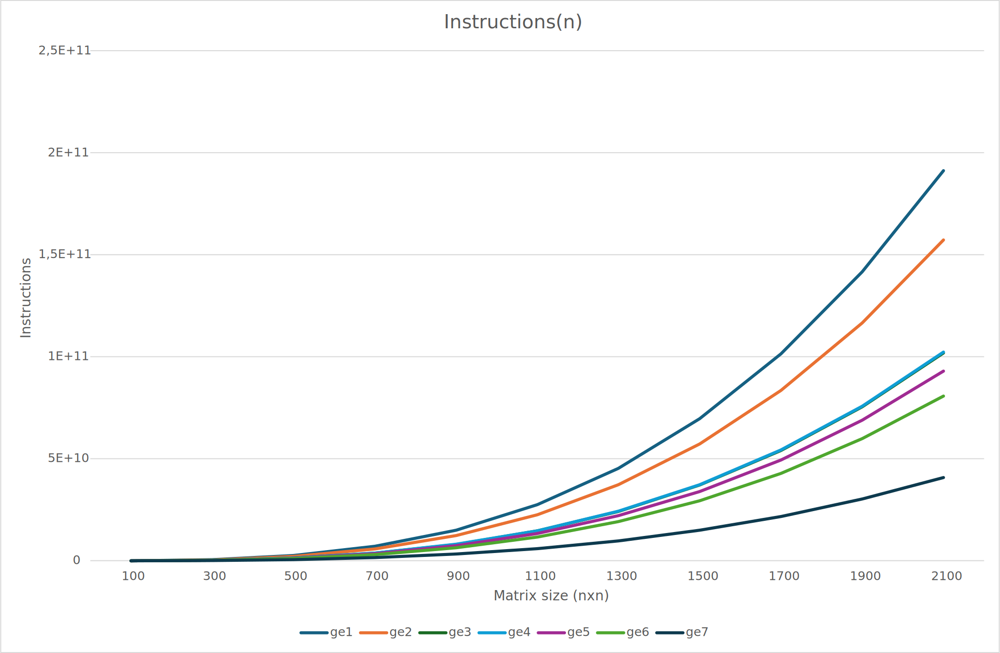

# Antoni Wójcik, 12.06.2024r.
## Optymalizacja Kodu Na Różne Architektury, gr. 5
## Zadanie domowe nr 2

### I Parametry procesora
| Parametr | Wartość |
|:---:|:---:|
| Producent | AMD |
| Model | Ryzen 5 3600X |
| Architektura | Zen 2 |
| Mikroarchitektura| "Matisse" |
| Rdzenie | 6 |
| Wątki | 12 |
| Max. częstotliwość | 4.4 GHz (max) |
| | 3.8 GHz (bazowo) |
| L1 cache | 64 KB |
| L2 cache | 512 KB |
| L3 cahce | 32 MB |
| GFlops | 1,267.2 (FP32 Single Precision) |
| GFlops/rdzeń | 211.2 |

[Źródło: Wikipedia](https://pl.wikipedia.org/wiki/Lista_procesor%C3%B3w_AMD_Ryzen) <br>
[Źródło: TECHpowerUP](https://www.techpowerup.com/cpu-specs/ryzen-5-3600x.c2131) <br>

> papi_avail
```zsh
Available PAPI preset and user defined events plus hardware information.
--------------------------------------------------------------------------------
PAPI version             : 6.0.0.0
Operating system         : Linux 5.15.146.1-microsoft-standard-WSL2
Vendor string and code   : AuthenticAMD (2, 0x2)
Model string and code    : AMD Ryzen 5 3600X 6-Core Processor (113, 0x71)
CPU revision             : 0.000000
CPUID                    : Family/Model/Stepping 23/113/0, 0x17/0x71/0x00
CPU Max MHz              : 3800
CPU Min MHz              : 3800
Total cores              : 12
SMT threads per core     : 2
Cores per socket         : 6
Sockets                  : 1
Cores per NUMA region    : 12
NUMA regions             : 0
Running in a VM          : yes
VM Vendor                : Microsoft Hv
Number Hardware Counters : 6
Max Multiplex Counters   : 384
Fast counter read (rdpmc): yes
--------------------------------------------------------------------------------
```
Kompilacja:
```zsh
gcc ge.c -o ge -lm -march=znver2 -I/${PAPI_DIR}/include -L/${PAPI_DIR}/lib -lpapi
```

### II Program wyjściowy [ge1.c]
```c
#include <stdio.h>
#include <stdlib.h>
#include <sys/time.h>
#include <time.h>
#include <assert.h>

/* Include PAPI */
#include <papi.h>

/* PAPI macro helpers definitions */
#define NUM_EVENT 2
#define THRESHOLD 100000
#define ERROR_RETURN(retval)                                                    \
    {                                                                           \
        fprintf(stderr, "Error %d %s:line %d: \n", retval, __FILE__, __LINE__); \
        exit(retval);                                                           \
    }

static double gtod_ref_time_sec = 0.0;

/* Adapted from the bl2_clock() routine in the BLIS library */

double dclock()
{
    double the_time, norm_sec;
    struct timeval tv;
    gettimeofday(&tv, NULL);
    if (gtod_ref_time_sec == 0.0)
        gtod_ref_time_sec = (double)tv.tv_sec;
    norm_sec = (double)tv.tv_sec - gtod_ref_time_sec;
    the_time = norm_sec + tv.tv_usec * 1.0e-6;
    return the_time;
}

int ge(double **A, int SIZE)
{
    int i, j, k;
    for (k = 0; k < SIZE; k++)
    {
        for (i = k + 1; i < SIZE; i++)
        {
            for (j = k + 1; j < SIZE; j++)
            {
                A[i][j] = A[i][j] - A[k][j] * (A[i][k] / A[k][k]);
            }
        }
    }
    return 0;
}

int main(int argc, char **argv)
{
    int i, j, k, iret, SIZE;
    double dtime;
    double **matrix;
    double *matrix_;

    /*Alocating and filling matrix*/
    SIZE = atoi(argv[1]);
    matrix_ = (double *)malloc(SIZE * SIZE * sizeof(double));
    matrix = (double **)malloc(SIZE * sizeof(double *));
    for (i = 0; i < SIZE; i++)
    {
        matrix[i] = matrix_ + i * SIZE;
    }
    srand(1);
    for (i = 0; i < SIZE; i++)
    {
        for (j = 0; j < SIZE; j++)
        {
            matrix[i][j] = rand();
        }
    }

    /* PAPI FLOPS variables */
    float real_time, proc_time, mflops;
    long long flpops;
    float ireal_time, iproc_time, imflops;
    long long iflpops;
    int retval;
    int measure = 0; // default value of what to measure

    /* PAPI counters variables */
    int tmp;
    int EventSet = PAPI_NULL;
    /*must be initialized to PAPI_NULL before calling PAPI_create_event*/

    int event_codes[NUM_EVENT] = {PAPI_TOT_INS, PAPI_TOT_CYC};
    char errstring[PAPI_MAX_STR_LEN];
    long long values[NUM_EVENT];

    if (argc > 2)
    {
        measure = atoi(argv[2]);
    }

    /* measurments */
    if (measure == 0)
    {
        dtime = dclock();
    }
    if (measure == 1)
    {
        if ((retval = PAPI_flops_rate(PAPI_FP_OPS, &ireal_time, &iproc_time, &iflpops, &imflops)) < PAPI_OK)
        {
            printf("Could not initialise PAPI_flops \n");
            printf("Your platform may not support floating point operation event.\n");
            printf("retval: %d\n", retval);
            exit(1);
        }
    }
    if (measure == 2)
    {
        /* initializing library */
        if ((retval = PAPI_library_init(PAPI_VER_CURRENT)) != PAPI_VER_CURRENT)
        {
            fprintf(stderr, "Error: %s\n", errstring);
            exit(1);
        }
        /* Creating event set   */
        if ((retval = PAPI_create_eventset(&EventSet)) != PAPI_OK)
        {
            ERROR_RETURN(retval);
        }
        /* Add the array of events PAPI_TOT_INS and PAPI_TOT_CYC to the eventset*/
        if ((retval = PAPI_add_events(EventSet, event_codes, NUM_EVENT)) != PAPI_OK)
        {
            ERROR_RETURN(retval);
        }
        /* Start counting */
        if ((retval = PAPI_start(EventSet)) != PAPI_OK)
        {
            ERROR_RETURN(retval);
        }
    }

    /*Calling ge()*/
    iret = ge(matrix, SIZE);

    if (measure == 0)
    {
        dtime = dclock() - dtime;
        printf("Time: %le \n", dtime);
    }
    if (measure == 1)
    {
        if ((retval = PAPI_flops_rate(PAPI_FP_OPS, &real_time, &proc_time, &flpops, &mflops)) < PAPI_OK)
        {
            printf("retval: %d\n", retval);
            exit(1);
        }
        printf("Real_time: %f Proc_time: %f flpops: %lld MFLOPS: %f\n", real_time, proc_time, flpops, mflops);
    }
    if (measure == 2)
    {
        /* Stop counting, this reads from the counter as well as stop it. */
        if ((retval = PAPI_stop(EventSet, values)) != PAPI_OK)
        {
            ERROR_RETURN(retval);
        }
        printf("\nThe total instructions executed are %lld, total cycles %lld\n", values[0], values[1]);
    }

    /*Check results*/
    double check = 0.0;
    for (i = 0; i < SIZE; i++)
    {
        for (j = 0; j < SIZE; j++)
        {
            check = check + matrix[i][j];
        }
    }

    printf("Check: %le \n", check);
    fflush(stdout);
    free(matrix);
    return iret;
}
```

### III Optymalizacje

#### Optymalizacja 1 [ge2.c]
```c
int ge(double **A, int SIZE) {
    int register i, j, k;
    for (k = 0; k < SIZE; k++) {
        for (i = k + 1; i < SIZE; i++) {
            for (j = k + 1; j < SIZE; j++) {
                A[i][j] = A[i][j] - A[k][j] * (A[i][k] / A[k][k]);
            }
        }
    }
    return 0;
}
```
W porównaniu do funkcji wyjściowej, w optymalizacji 1 dodano deklarację zmiennych `i`, `j`, `k` jako register.

#### Optymalizacja 2 [ge3.c]
```c
int ge(double **A, int SIZE) {
    int register i, j, k;
    for (k = 0; k < SIZE; k++) {
        for (i = k + 1; i < SIZE; i++) {
            double register multiplier = A[i][k] / A[k][k];
            for (j = k + 1; j < SIZE; j++) {
                A[i][j] = A[i][j] - A[k][j] * multiplier;
            }
        }
    }
    return 0;
}
```
Optymalizacja 2 wprowadza bardziej znaczące ulepszenie poprzez redukcję liczby operacji dzielenia i szybszy dostęp do zmiennej `multiplier`, co może przyspieszyć wykonanie wewnętrznej pętli.

#### Optymalizacja 3 [ge4.c]
```c
int ge(double **A, int SIZE) {
    int register i, j, k;
    for (k = 0; k < SIZE; k++) {
        for (i = k + 1; i < SIZE; i++) {
            double register multiplier = A[i][k] / A[k][k];
            for (j = k + 1; j < SIZE;) {
                if (j < max(SIZE - BLKSIZE, 0)) {
                    A[i][j] = A[i][j] - A[k][j] * multiplier;
                    A[i][j + 1] = A[i][j + 1] - A[k][j + 1] * multiplier;
                    A[i][j + 2] = A[i][j + 2] - A[k][j + 2] * multiplier;
                    A[i][j + 3] = A[i][j + 3] - A[k][j + 3] * multiplier;
                    A[i][j + 4] = A[i][j + 4] - A[k][j + 4] * multiplier;
                    A[i][j + 5] = A[i][j + 5] - A[k][j + 5] * multiplier;
                    A[i][j + 6] = A[i][j + 6] - A[k][j + 6] * multiplier;
                    A[i][j + 7] = A[i][j + 7] - A[k][j + 7] * multiplier;
                    j += BLKSIZE;
                } else {
                    A[i][j] = A[i][j] - A[k][j] * multiplier;
                    j++;
                }
            }
        }
    }
    return 0;
}
```
Optymalizacja 3 wprowadza zaawansowaną technikę blokowania pętli, która ma na celu redukcję narzutu kontrolnego i poprawę efektywności pamięci podręcznej, co może znacząco zwiększyć wydajność w porównaniu do poprzednich wersji.

#### Optymalizacja 4 [ge5.c]
```c
int ge(double *A, int SIZE) {
    int register i, j, k;
    for (k = 0; k < SIZE; k++) {
        for (i = k + 1; i < SIZE; i++) {
            double register multiplier = A[IDX(i, k, SIZE)] / A[IDX(k, k, SIZE)];
            for (j = k + 1; j < SIZE;) {
                if (j < max(SIZE - BLKSIZE, 0)) {
                    A[IDX(i, j, SIZE)] = A[IDX(i, j, SIZE)] - A[IDX(k, j, SIZE)] * multiplier;
                    A[IDX(i, j + 1, SIZE)] = A[IDX(i, j + 1, SIZE)] - A[IDX(k, j + 1, SIZE)] * multiplier;
                    A[IDX(i, j + 2, SIZE)] = A[IDX(i, j + 2, SIZE)] - A[IDX(k, j + 2, SIZE)] * multiplier;
                    A[IDX(i, j + 3, SIZE)] = A[IDX(i, j + 3, SIZE)] - A[IDX(k, j + 3, SIZE)] * multiplier;
                    A[IDX(i, j + 4, SIZE)] = A[IDX(i, j + 4, SIZE)] - A[IDX(k, j + 4, SIZE)] * multiplier;
                    A[IDX(i, j + 5, SIZE)] = A[IDX(i, j + 5, SIZE)] - A[IDX(k, j + 5, SIZE)] * multiplier;
                    A[IDX(i, j + 6, SIZE)] = A[IDX(i, j + 6, SIZE)] - A[IDX(k, j + 6, SIZE)] * multiplier;
                    A[IDX(i, j + 7, SIZE)] = A[IDX(i, j + 7, SIZE)] - A[IDX(k, j + 7, SIZE)] * multiplier;
                    j += BLKSIZE;
                } else {
                    A[IDX(i, j, SIZE)] = A[IDX(i, j, SIZE)] - A[IDX(k, j, SIZE)] * multiplier;
                    j++;
                }
            }
        }
    }
    return 0;
}
```
W porównaniu do optymalizacji 3, optymalizacja 4 zmienia sposób przechowywania i dostępu do danych macierzy, przechodząc z podwójnego wskaźnika (`double **A`) na pojedynczy wskaźnik (`double *A`) z użyciem makra `IDX` do obliczania indeksów.

#### Optymalizacja 5 [ge6.c]
```c
int ge(double *A, int SIZE) {
    register unsigned i, j, k;
    register double multiplier;
    register __m128d mm_multiplier;
    register __m128d tmp0, tmp1, tmp2, tmp3, tmp4, tmp5, tmp6, tmp7;
    for (k = 0; k < SIZE; k++) {
        for (i = k + 1; i < SIZE; i++) {
            multiplier = A[IDX(i, k, SIZE)] / A[IDX(k, k, SIZE)];
            mm_multiplier[0] = multiplier;
            mm_multiplier[1] = multiplier;
            for (j = k + 1; j < SIZE;) {
                if (j < max(SIZE - BLKSIZE, 0)) {
                    mm_multiplier = _mm_set1_pd(multiplier);
                    tmp0 = _mm_loadu_pd(A + IDX(i, j, SIZE));
                    tmp1 = _mm_loadu_pd(A + IDX(k, j, SIZE));
                    tmp2 = _mm_loadu_pd(A + IDX(i, j + 2, SIZE));
                    tmp3 = _mm_loadu_pd(A + IDX(k, j + 2, SIZE));
                    tmp4 = _mm_loadu_pd(A + IDX(i, j + 4, SIZE));
                    tmp5 = _mm_loadu_pd(A + IDX(k, j + 4, SIZE));
                    tmp6 = _mm_loadu_pd(A + IDX(i, j + 6, SIZE));
                    tmp7 = _mm_loadu_pd(A + IDX(k, j + 6, SIZE));

                    tmp1 = _mm_mul_pd(tmp1, mm_multiplier);
                    tmp3 = _mm_mul_pd(tmp3, mm_multiplier);
                    tmp5 = _mm_mul_pd(tmp5, mm_multiplier);
                    tmp7 = _mm_mul_pd(tmp7, mm_multiplier);

                    tmp0 = _mm_sub_pd(tmp0, tmp1);
                    tmp2 = _mm_sub_pd(tmp2, tmp3);
                    tmp4 = _mm_sub_pd(tmp4, tmp5);
                    tmp6 = _mm_sub_pd(tmp6, tmp7);

                    _mm_storeu_pd(A + IDX(i, j, SIZE), tmp0);
                    _mm_storeu_pd(A + IDX(i, j + 2, SIZE), tmp2);
                    _mm_storeu_pd(A + IDX(i, j + 4, SIZE), tmp4);
                    _mm_storeu_pd(A + IDX(i, j + 6, SIZE), tmp6);
                    j += BLKSIZE;
                } else {
                    A[IDX(i, j, SIZE)] = A[IDX(i, j, SIZE)] - A[IDX(k, j, SIZE)] * multiplier;
                    j++;
                }
            }
        }
    }
    return 0;
}
```
W porównaniu do optymalizacji 4, optymalizacja 5 wprowadza użycie instrukcji SIMD (Single Instruction, Multiple Data) przy wykorzystaniu rozszerzeń SSE (Streaming SIMD Extensions) do równoległego przetwarzania elementów macierzy.


- **Użycie SIMD**: Zastosowanie instrukcji SIMD z rozszerzeniami SSE (`__m128d`) do równoległego przetwarzania par elementów macierzy, co pozwala na wykonywanie operacji na wielu danych w jednej instrukcji.
- **Rejestry SIMD**: Rejestry SIMD (`__m128d`) są wykorzystywane do przechowywania i manipulowania wartościami w blokach po dwa elementy.
- **Wykorzystanie `_mm_set1_pd` i `_mm_loadu_pd`**: Funkcje `_mm_set1_pd` i `_mm_loadu_pd` są używane do ustawiania wartości w rejestrach SIMD oraz do ładowania danych do tych rejestrów.


- **Równoległe przetwarzanie**: Użycie instrukcji SIMD umożliwia równoległe przetwarzanie dwóch elementów jednocześnie, co może znacząco zwiększyć wydajność w porównaniu do skalarnego przetwarzania danych.
- **Lepsza przepustowość**: SIMD może zwiększyć przepustowość operacji matematycznych, redukując liczbę potrzebnych instrukcji procesora.
- **Efektywne wykorzystanie rejestrów**: Przechowywanie wartości w rejestrach SIMD może poprawić efektywność operacji poprzez redukcję liczby dostępów do pamięci.


- **Złożoność implementacji**: Użycie instrukcji SIMD zwiększa złożoność kodu, co może utrudnić jego czytanie i utrzymanie.
- **Wymagana architektura**: Ta optymalizacja wymaga procesora z obsługą SSE, co może ograniczać jej zastosowanie na starszych maszynach.
- **Wielkość bloków (`BLKSIZE`)**: Dostosowanie wielkości bloków do rozmiarów wektorów SIMD może być kluczowe dla osiągnięcia maksymalnej wydajności.

Podsumowując, optymalizacja 5 wprowadza zaawansowaną technikę równoległego przetwarzania danych przy użyciu instrukcji SIMD, co może znacząco poprawić wydajność operacji macierzowych poprzez równoległe wykonywanie operacji matematycznych na parach elementów. Ta optymalizacja jest bardziej skomplikowana, ale potencjalnie oferuje większe korzyści wydajnościowe w porównaniu do poprzednich wersji.

#### Optymalizacja 6 [ge7.c]
```c
int ge(double *A, int SIZE) {
    register unsigned i, j, k;
    register double multiplier;
    register __m256d mm_multiplier;
    register __m256d tmp0, tmp1, tmp2, tmp3, tmp4, tmp5, tmp6, tmp7;
    for (k = 0; k < SIZE; k++) {
        for (i = k + 1; i < SIZE; i++) {
            multiplier = A[IDX(i, k, SIZE)] / A[IDX(k, k, SIZE)];
            mm_multiplier[0] = multiplier;
            mm_multiplier[1] = multiplier;
            mm_multiplier[2] = multiplier;
            mm_multiplier[3] = multiplier;
            for (j = k + 1; j < SIZE;) {
                if (j < max(SIZE - BLKSIZE, 0)) {
                    mm_multiplier = _mm256_set1_pd(multiplier);
                    tmp0 = _mm256_loadu_pd(A + IDX(i, j, SIZE));
                    tmp1 = _mm256_loadu_pd(A + IDX(k, j, SIZE));
                    tmp2 = _mm256_loadu_pd(A + IDX(i, j + 4, SIZE));
                    tmp3 = _mm256_loadu_pd(A + IDX(k, j + 4, SIZE));
                    tmp4 = _mm256_loadu_pd(A + IDX(i, j + 8, SIZE));
                    tmp5 = _mm256_loadu_pd(A + IDX(k, j + 8, SIZE));
                    tmp6 = _mm256_loadu_pd(A + IDX(i, j + 12, SIZE));
                    tmp7 = _mm256_loadu_pd(A + IDX(k, j + 12, SIZE));

                    tmp1 = _mm256_mul_pd(tmp1, mm_multiplier);
                    tmp3 = _mm256_mul_pd(tmp3, mm_multiplier);
                    tmp5 = _mm256_mul_pd(tmp5, mm_multiplier);
                    tmp7 = _mm256_mul_pd(tmp7, mm_multiplier);

                    tmp0 = _mm256_sub_pd(tmp0, tmp1);
                    tmp2 = _mm256_sub_pd(tmp2, tmp3);
                    tmp4 = _mm256_sub_pd(tmp4, tmp5);
                    tmp6 = _mm256_sub_pd(tmp6, tmp7);

                    _mm256_storeu_pd(A + IDX(i, j, SIZE), tmp0);
                    _mm256_storeu_pd(A + IDX(i, j + 4, SIZE), tmp2);
                    _mm256_storeu_pd(A + IDX(i, j + 8, SIZE), tmp4);
                    _mm256_storeu_pd(A + IDX(i, j + 12, SIZE), tmp6);
                    j += BLKSIZE;
                } else {
                    A[IDX(i, j, SIZE)] = A[IDX(i, j, SIZE)] - A[IDX(k, j, SIZE)] * multiplier;
                    j++;
                }
            }
        }
    }
    return 0;
}
```
Optymalizacja 6 wprowadza dalsze wykorzystanie SIMD, przechodząc z SSE do AVX (Advanced Vector Extensions), co pozwala na przetwarzanie większej liczby danych równocześnie.


- **Użycie AVX (Advanced Vector Extensions)**: Zastosowanie instrukcji AVX (`__m256d`) do równoległego przetwarzania czterech elementów macierzy jednocześnie, co podwaja ilość przetwarzanych danych w porównaniu do SSE.
- **Rejestry AVX**: Rejestry AVX (`__m256d`) są wykorzystywane do przechowywania i manipulowania wartościami w blokach po cztery elementy.
- **Wykorzystanie `_mm256_set1_pd` i `_mm256_loadu_pd`**: Funkcje `_mm256_set1_pd` i `_mm256_loadu_pd` są używane do ustawiania wartości w rejestrach AVX oraz do ładowania danych do tych rejestrów.


- **Większa równoległość**: Użycie AVX umożliwia równoległe przetwarzanie czterech elementów, co zwiększa wydajność w porównaniu do przetwarzania dwóch elementów z SSE.
- **Lepsza przepustowość**: AVX oferuje większą przepustowość operacji matematycznych, umożliwiając wykonywanie większej liczby operacji na cykl procesora.
- **Zwiększona wydajność**: Przechowywanie i manipulowanie większą liczbą danych w rejestrach AVX może znacząco poprawić wydajność przez redukcję liczby potrzebnych operacji.


- **Złożoność implementacji**: Podobnie jak w przypadku SIMD z SSE, użycie AVX zwiększa złożoność kodu.
- **Wymagana architektura**: Ta optymalizacja wymaga procesora z obsługą AVX, co może ograniczać jej zastosowanie na starszych maszynach.
- **Wielkość bloków (`BLKSIZE`)**: Dostosowanie wielkości bloków do rozmiarów wektorów AVX jest kluczowe dla osiągnięcia maksymalnej wydajności.

Podsumowując, optymalizacja 6 wprowadza zaawansowane techniki równoległego przetwarzania danych przy użyciu instrukcji AVX, co pozwala na przetwarzanie czterech elementów jednocześnie. Ta optymalizacja oferuje potencjalnie wyższą wydajność w porównaniu do poprzednich wersji, wykorzystując bardziej zaawansowane rozszerzenia procesora.

### IV Porównanie wydajności

#### Real Time


#### Instructions


#### Cycles


#### MFLOPS


### V Wnioski
Zgodnie z oczekiwaniami, najwydajniejsza okazała się ostatnia optymalizacja, a więc uzycie AVX. Pozwoliła ona zrównoleglić obliczenia, skutkując najwyższym wynikiem MFLOP/s. Jest ona jednak skomplikowana i wymaga zrozumienia wielu mechanizmów. Pod względem relacji poziomu skomplikowania do przyrostu wydajności należy wyróżnić optymalizację nr 2 (wprowadzenie mnożnika jako zmienną register). Była ona stosunkowo łatwa w implementacji, a oferowana przez nią wydajność znalazła się na 3 miejscu.